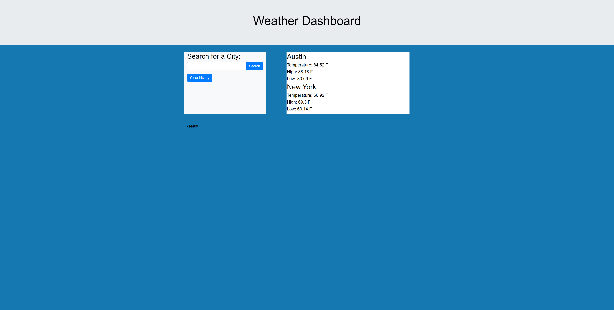

# Weather-Dashboard-BO
Homework 6 weather dashboard

This is a weather dashboard. You can use this to see the weather in a particular city.

Whether you want to plan a vacation, or just make sure that today has perfect fishing weather, the weather dashboard will help make sure you stay safe and dry!

This HW uses a weather API from OpenWeatherMap.org

The 2 weather API's I used are: Current Weather Data, and One Call API.

Though only certain info shows up on the page, the console will show an array of information which makes this dashboard very customizable for whatever the occasion may be.

Github Link: https://bradmw.github.io/Weather-Dashboard-BO/

